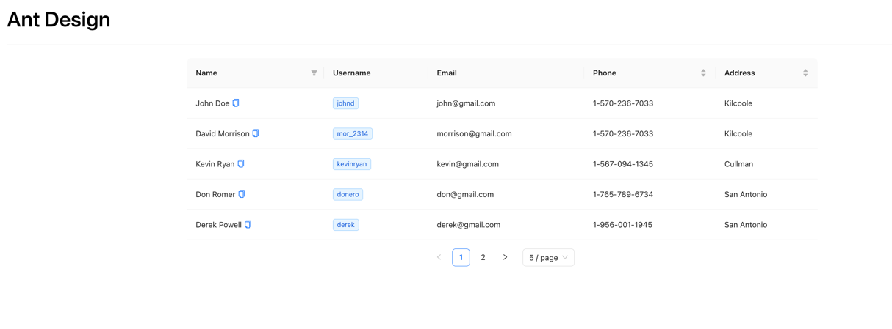

# Ant-Design Demo

#### Целью проекта было познакомиться с библиотекой компонентов Ant-Design и посмотреть возможности данной библиотеки.

Была реализована небольшая таблица на мок-данных, в которой была пагинация, сортировка и фильтрация данных.
Для пагинации можно выбрать количество данных на странице.
Для столбца имени реализовано копирование, при клике на иконку копировать.

### Стек - Ant-Design, Prettier, React.

### Для старта необходимо выполнить команду 

### `yarn`

А затем:

### `yarn start`

Сервер запустится и откроется на [http://localhost:3000](http://localhost:3000).

### Демонстрация интерфейса

